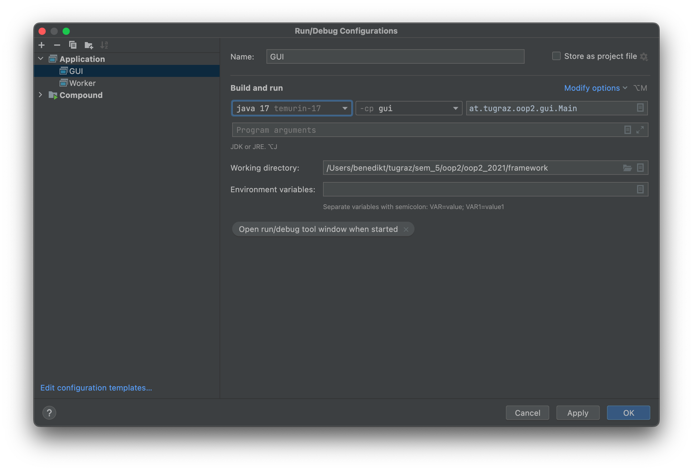
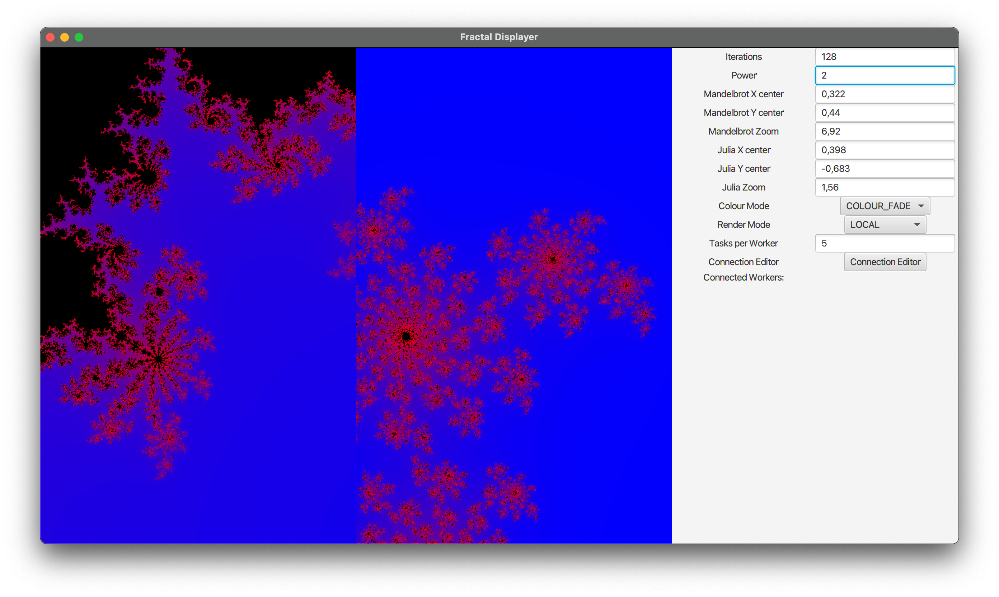
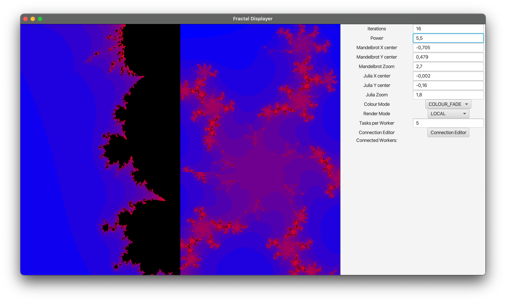
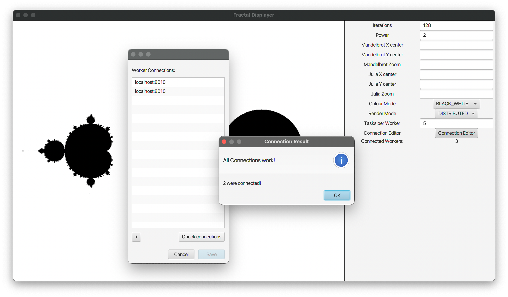

# Objektorientierte Programmierung 2 KU Assignment 2022

# Overview

The goal of this course is to get familiar with advanced object-oriented concepts by implementing a GUI-application and
a corresponding worker-server, where one can interactively explore the Mandelbrot and Julia Set.

Throughout this course, you will implement this application using the Java 17 programming language along with a simple
framework provided by us.

# Important

## Timeline

* **Assignment Preparation** (no due date)
  * Reading the whole assignment description, setting up your workspace and getting ready.
* **Assignment Submission** (Due date 20.12.2022, 23:55)
  * Fully working GUI-Application with built-in multithreading and visualization of the fractals
  * Calculation of the images on separate processes using worker-servers
* **Assignment Interviews** (Expected in the weeks of 9.01.2023-20.01.2023)
  * You will discuss your solution with a tutor and show possible bonus tasks you have completed
  * Your final score is determined in this interview and depends on your familiarity with the whole project your group delivered as well as how close to specification your assignment is built. 
## Requirements

* You are allowed to work in groups of up to 4 students. You should share the workload across every student evenly, in the end every student must know everything about your submission.
* Plagiarism will not be tolerated
* Every student has to push to the git repository, working from one computer only is **not** in the spirit of the course.

## Assignment Preparation - Setting up Your Workspace

This assignment has no due date and won't be graded, but you should nevertheless get it done ASAP and contact us in case
you encounter difficulties.

## Team Registration

By the time you read this, you should have already formed teams of up to 4 students. The teams stay the same throughout the course. Please tell us if a teammate drops out.

## System Requirements

You should have the following programs installed on your machine (and set up properly using the `$PATH` and `$JAVA_HOME` environment variables):

* Git
* Java 17
* Maven
* A Java IDE such as IntelliJ, VSCode or Eclipse

## Checking out the Framework

You should have been granted access to a git repository designated to your team. All your progress/commits must be documented in this repository, so you aren't allowed to use any other versioning system or another Git service. Our GitLab instance can be found at <https://student.cgv.tugraz.at/>. To sign in, click "Sign in with TUGRAZ online (Students)". Use SSH for authenticating yourself in Git. You'll need to
generate an SSH keypair (if you haven't already) and add it to
your [GitLab Profile](https://student.cgv.tugraz.at/-/profile/keys).

Open a shell on your machine and issue the following commands:

```
# Clone your team repository, NOT the framework.
# XXX is your Assignment Team number
git clone git@student.cgv.tugraz.at:oop2_2022/XXX.git 
cd XXX

# Set your Git credentials. Use "--global" instead of "--local" if you
# use Git exclusively at TUGraz.
git config --local user.name "Max Muster"
git config --local user.email "max.muster@student.tugraz.at"
```


If everything has worked so far, you should see the contents of the framework in your current directory.

Changes to the framework will be announced on [TeachCenter Announcements](https://tc.tugraz.at/main/mod/forum/view.php?id=52959).

## Starting the System

The framework for the GUI application is located in the gui-submodule, you can start it from the terminal using `mvn clean install && mvn exec:java -pl gui`  while in the root directory of your project. This should already display a very basic GUI with three blank panels.

## Setting up Your IDE

Which IDE you use depends on your personal preferences.

### IntelliJ

We recommend the Jetbrains IntelliJ IDE for development. You can get this IDE for free by applying at <https://www.jetbrains.com/shop/eform/students> (or the community edition without signing up). Install IntelliJ IDEA with the default settings. You can now open the project by opening the `pom.xml` file from the root project directory with IntelliJ. In order to run the application, you need to set up a new application target by selecting `Add Configuration` in the top right corner.
Your settings should look like this (after choosing `+` -> `Application` ):



The framework is using Project Lombok to generate getters and setters for data classes. It will work without any additional setup on your side, but IntelliJ will show errors (which can be ignored) if you don't install the `Lombok`
plugin.\
For a quick overview of what Lombok does check out <https://projectlombok.org/>

## When You're Done ...

... with setting everything up, help your teammates with doing the same and then get some sleep. If you encounter any
problems, contact us ASAP.

# Framework

The framework is composed of a Maven project holding 3 child projects with different purposes. The
gui-project depends on the shared-project, which is designated for general functionality such as the calculation of the fractals themselves or some general Data-classes. We **strongly** encourage you to place the functionality of calculating the fractals and every needed dependency for that into the shared project, as you are required to perform these operations from the workers too. Do not introduce additional dependencies between those 3 projects. In case you want to use other third party libraries, ask for permission in the [TeachCenter forum](https://tc.tugraz.at/main/mod/forum/view.php?id=52962) of this course.

Do not change the general file structure given in the framework, i.e. do not move the root of the Maven project and do not rename projects or change their version/packages. However, you are free to add new packages or source files as long as your submission compiles and fulfills its purpose.

There is a **FractalLogger** class provided by us. Use each function as described in the comments in the `FractalLogger.java` file. You have to call those functions correctly. You have to use the functions as described and you are not allowed to modify the parameters or create new functions, since we will replace this file for our internal testing and final grading. If you want to log additional stuff, create a development logging class that suits you, but please deactivate it in the final submission. Beware, even if your program works correctly, but does not log all operations as required, you will get deductions.

## Shared

The **shared** project contains a variety of helpful classes and interfaces. Feel free to introduce as many classes and interfaces as you need and extend our classes (except, as already mentioned, `FractalLogger`). `SimpleImage` represents a Bitmap-Image where you can efficiently set and get single pixels. `FractalRenderOptions` and its derived classes contain all needed options in order to calculate the specified fractal.

## GUI

The main method of the **gui** project is located at `at.tugraz.oop2.gui.Main.main(String... args)`. The client should be able to parse arguments as described below.

## Logger

Every relevant action, which has a corresponding Logger function, has to call their function when specified. Look up the documentation in the `FractalLogger.java` file in **shared**.

The logger function `logArguments` must get the used `DoubleProperties` linked to the Properties you use internally - you will get ***0 points*** on ***all*** tasks otherwise!

Furthermore, everything ending with -`GUI` must be called within the UI. Similarly, everything ending with -`Worker` has to be called within the server. If neither is contained, you should call them in the GUI (and in the first part of the Assignment).

# General Remarks

This document specifies the goals of the assignment and gives hints on how to implement solutions. It is deliberately not intended by us to completely define all specifics of the implementation. Students are required to do their own design decisions where needed, and this is actually one of the learning goals of the assignment.

Aside from implementing the features described below, the submission must fulfill a number of requirements:

* The system must be able to handle errorneous input from either the startup arguments or the parameters entered using the GUI.
* The GUI shall not freeze if the calculation takes longer.
* There should be no dangling threads upon closing the main window.
* The system shall be reactive e.g. the fractals are redrawn if the parameters change either through input or gestures and the parameters in the GUI are updated accordingly.
* The UI should be properly scaled upon startup and already display the fractals (with default or given parameters) - On some linux system an initial manual resize of the window is necessary.

When your submission is graded, the last commit before the deadline on the **main** branch is checked out. Don't forget to write the file `SUBMISSION.md` in the root directory of your repository, where you document important design decisions and open issues.

# GUI and calculation of the fractals

In the first part of the assignment you will complete the major part of the GUI and all the logic necessary to calculate and explore the displayed fractals. Both of the fractals will be connected by setting the center of the rendered Mandelbrot (left canvas) as a parameter of the Julia Set (right canvas) and interactively update these parameters.

## Parse the arguments passed to the GUI-program (**5P**)

The arguments should set certain initial parameters and can override the default values. They have to be passed in the form `--<name>=<value>` to the program. The following parameters must be supported and set the corresponding default values if not provided or can not be parsed. The parameter names must be **case insensitive**:

* name: `iterations`:  type integer, default value: `128`
* name: `power`:  type floating point, default value: `2.0`
* name: `mandelbrotX`:  type floating point, default value: `0.0`
* name: `mandelbrotY`:  type floating point, default value: `0.0`
* name: `mandelbrotZoom`:  type floating point, default value: `0.0`
* name: `juliaX`:  type floating point, default value: `0.0`
* name: `juliaY`:  type floating point, default value: `0.0`
* name: `juliaZoom`:  type floating point, default value: `0.0`
* name: `colourMode`:  type enumerable (`BLACK_WHITE`, `COLOUR_FADE`), default value: `BLACK_WHITE`

## Multi-threading of the UI (**10P**)

The UI should stay responsive while the fractals are calculated and still react to a change of the window size, scrolling, entering parameters and so on. Hint: You may use `Service<T>` or `Task<T>`, about which you can read more in the JavaFX documentation.

## Calculation of the Fractals (**10P**)

The implementation should calculate a Mandelbrot set and a Julia set as an image. You should use the class `SimpleImage` to transfer the image between methods and objects. Both fractals are displayed on the complex plane, with the x-axis being the real dimension and the y-axis the imaginary dimension. Do not flip the y-axis for display purposes (see example image below).

### Mandelbrot - Multibrot Set

The Mandelbrot set is calculated by iteratively evaluating the following formula until the magnitude
of  is 2 or
greater:


This has to be done an infinite number of times for each point in the input domain to prove that the point in question is part of the Mandelbrot set. If the magnitude did not exceed 2, the calculated point is part of the set. In order to approximate the set, we stop after a specified amount of iterations. This calculation has to be done for each pixel ) on the image.

The resulting image is a [Multibrot set](https://en.wikipedia.org/wiki/Multibrot_set) (black pixel - part of the set, white pixel - not part of the set). In the case of  it is also called Mandelbrot. For this exercise use any real number  for .

Transforming pixel coordinates to the complex plane just needs a few parameters: the image aspect ratio, the origin of the Mandelbrot set and a zoom value. The width and height of the image (not in pixels but on the complex plane) are calculated using following formulas:


Transforming pixel coordinates to the complex plane is accomplished by the following formula with ) as center of the complex plane:


### Julia set with arbitrary powers

The generation of the Julia set is really easy once you have a correct Mandelbrot set, as the parameters are simply exchanged to the following properties of the images:


For this exercise use .

### Complex Numbers Refresher

For the fractals you had to calculate . It is easier to calculate this in polar form () instead of cartesian form ():

&plus;i*sin(\varphi))=\left|z\right|*e^{i*\varphi})

)


Now it is easy to calculate  to the power of :

&plus;i*\left|z\right|^k*sin(\varphi*k))

Note that the magnitude  is taken to the power of , while the angle  is multiplied by .

## Rendering & UI creation (**á 5P -> 15P**)

### Display the Mandelbrot set

The Mandelbrot set should now be displayed from the resulting `SimpleImage` class on the **left** canvas.

### Display the Julia set

The Julia set should now be displayed from the resulting `SimpleImage` class on the **right** canvas.

### Show the parameters

The UI should also display the parameters used for calculation. All the parameters that can be given using the arguments have to be displayed reactively and must be editable. Any change should trigger an update to the rendered fractals (and the `FractalLogger` using bound properties!).

## Parameter linking (**5P**)
The constant parameter  of the Julia fractal should always be equal to the center point of the Mandelbrot set. This way the Mandelbrot set acts as an atlas for all possible Julia fractal iterations.
***Hint***: the minimal solution is **2 lines of code** if you use properties.

## Colour-Modes (**10P**)

The default colours of the fractals are just black and white - in order to spice things up, you can interpolate between two colours linearly using the escaped iteration count (where the magnitude of  exceeds 2) and the total iterations by calculating:


The colours can simply be interpolated using , two given colours (red `rgb(255,0,0)` and blue `rgb(0,0,255)`) and the following formula:

)

The modes should be changeable using both the UI or the CLI parameters. It is mandatory to use the two given colours as default colours. You may implement a colour picker (at your own leisure) to pick other colours!

## Panning and zooming (**10P**)

To actually explore the colourful fractals, the user needs to be able to drag and zoom in the displayed fractals. The application should therefore offer the possibility to drag inside the panel and move the center of each fractal in the correct direction and drag 'convincingly', so that the fractal moves with the cursor. The mouse wheel should change the zoom parameter of the fractal canvas being scrolled on by a factor of `0.02` for each tick the scroll wheel moves. The fractal and parameters displayed on the side should change accordingly and instantaneously.


# Distributed Calculations of Workloads


In the second part of the Assignment you will define and implement a networked, distributed calculation of the fractals. Your final solution should distribute the workload dynamically and be able to handle connection issues and slow workers correctly. 

You can receive a total of 35 points on this part.

## New parameters and settings of the GUI (**2.5P**)

The first task of this section requires you to add new command-line parameters to the Application, where you must be able to set the mode of operation (local or remote calculation) and the worker connection string (the format and the **case insensitivity** stays the same: `--<name>=<value>`):
* name: `tasksPerWorker`:  type int, default value: 5
* name: `renderMode`:  type enumerable (`LOCAL`, `DISTRIBUTED`), default value: `LOCAL`
* name: `connection`:  type string, format: `ip1:port1,ip2:port2`, default value: `localhost:8010` (your string should support any number of connections!)

## GUI setting to configure connection (**5P**)

The settings from above should also be able to be configured within the GUI. How you solve it is up to you, but you should at least be able to:
* change, add and remove remote worker connection addresses
* test the connection
* give visual feedback on how many remote workers are currently connected

These GUI settings can be disabled while rendering.

## Starting the server and passing the correct parameter (**2.5P**)

The server must be implemented in the `worker`-module, where we provide the `Server`-class, which already has a `main`-method. The parameters should be passed in a similar fashion as to the GUI: with `--<name>=<value>` as the format. The possible arguments are:

* name: `port`:  type integer, default value: `8010`.

The server should start on the specified port and listen for new connections.

## Connectin handling (total of **10P**)

The following paragraphs describe the minimal requirements for your connection handling logic. You can implement it in any way you like, just make sure that you fulfill all requirements.

### Establishing the connection (**3P**)
Using the parameters gathered from either the UI or the command line, the connection to all the workers should be established or tested immediately after either the UI-settings were saved or the command line arguments specified the rendering mode to be `DISTRIBUTED`. The workers should be able to handle an arbitrary number of connections.

### Handling disconnected workers (**4P**)

Your rendering must still work if the worker disconnects during the rendering or between individual requests. You should, if such a case occurs, balance the load on other workers and still finish the current request. You should finish the rendering locally if no workers are present anymore.

### Handling timeouts (**3P**)

Additionally, you should handle lost connections (max. after 10 seconds). You have to detect timeouts even if no rendering tasks are currently performed.

## Splitting and combining the Workload (**8P**)

You should split the rendering into equal-sized chunks. Using the parameter `tasksPerWorker` and multiplying it with the number of active workers (when the request was issued) yields the total number of tasks you should distribute across all workers. How you may split up the work depends on you, but your output should still look the same.

## Distributing the Workload (**7P**)

The GUI should be able to distribute the workload using the split workload and known connections dynamically among the workers. This requires you to not immediately send all packets to all workers first, but e.g. one per worker and wait until you've got a response. You should try to utilise the remote workers as good as possible.

## Hints

* You may use either TCP or UDP, but you should document your decision in `SUBMISSION.md`
* You can use a repeated ping-like system to detect disconnected workers
* How you distribute the workload is up to you (serve fast-finishing first, measure performance, etc.), but try to avoid idle remote workers
* You can freely decide how you split the workload (using stripes, chunks of pixels, ...), but you should guarantee, that the final image is the same and fully present (and, of course, document everything in `SUBMISSION.md`).
* You may notice that the distributed rendering may not be faster than your single-machine (maybe multithreaded) implementation - this is expected due to the overhead introduced. However, we will not grade your efficiency (within reason) but want you to understand how such a system may be implemented.

# Bonus tasks

You may implement a few bonus tasks if you are interested in the content of the course or want to make sure you get the grade you want. Please note that we only add your bonus tasks once you have reached a positive grade (more than half of the reachable points in the main assignment). The bonus tasks are up to you, but please ask either in the question hour or on the teach center forum whether you will get points for them or the amount of points you want. When implementing bonus tasks you need to make sure that the basic implementation still works as intented.

Here are a few tasks we would give out points for (and which may serve as inspiration):

* displaying or visualizing the render time somewhere within the GUI (not on the canvas!) (2 points for a basic implementation, more if you visualize e.g. the last few frames or render time vs. iterations)
* pickable colours or more modes for the fractal images, e.g. a colour picker, exponential fade, smoother transitions, ... (2 points for a basic implementation, more for more advanced patterns)
* new fractal types on the second panels (5+ points, depending on the fractal)

# Sample image

To give you an idea how your application could look like, we have provided a sample image. If you enter these parameters, your fractals should look similar:





## Sample GUI




# Grading

You can achieve a total of **100 points**. To get a grade, you have to perform at least one significant commit to the repository. You will be graded the following way:

```
public static Grade getGrade(float ass, float bonus) {
  if (ass >= 50) { 
    float total = ass + (bonus < 10 ? bonus: 10);
    if (total >= 86) {
      return Grade.SEHR_GUT; // 1
    }
    if (total >= 74) {
      return Grade.GUT; // 2
    }
    if (total >= 62) {
      return Grade.BEFRIEDIGEND; // 3
    }
    return Grade.GENUEGEND; // 4
  }
  return Grade.NICHT_GENUEGEND; // 5
}
```

If you have a "Nicht genügend", you will have to hand in a second chance within a week after your assignment interview and your points will be calculated the following way:
```
total = (total >= 50) ? 50 + (total - 50) / 2 : total 
```
Which means that if you need a second chance, all of your points above 50% will be halved.
